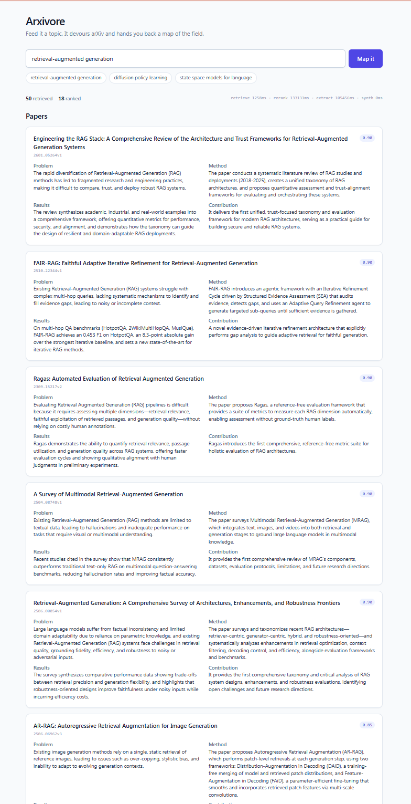

# Arxivore

Map an entire ML research field from a single plain-English search.

Enter a topic — the agent pulls papers from arXiv, reranks them by semantic
relevance, extracts structured insights per paper, and synthesizes a cross-paper
landscape of clusters, relationships, tensions, and open problems. The reading
map grows over time as you run more searches.

## Features

- 🔍 **Plain-English search** — describe a field in natural language, no boolean
  query syntax required.
- 📚 **arXiv retrieval** — pulls up to 50 candidate papers per topic.
- 🎯 **Semantic reranking** — an LLM reorders candidates by true relevance to
  your intent, not just keyword overlap, keeping the top ~18.
- 🧬 **Structured extraction** — each paper distilled into
  *problem · method · results · contribution*, extracted concurrently.
- 🗺️ **Cross-paper synthesis** — a research landscape of clusters,
  inter-cluster relationships, tensions, and open problems.
- 🛡️ **Resilient pipeline** — a single paper's extraction failure never sinks
  the run; synthesis proceeds with what succeeded.
- 💸 **Cost-controlled** — bounded candidate counts, token caps, and
  provider-agnostic config (OpenRouter free models by default).
- 🔌 **Provider-agnostic LLM** — OpenAI-compatible client; switch between
  OpenRouter, Gemini, or others by editing two `.env` lines.

## Workflow

```
                         ┌──────────────────────────┐
   "retrieval-augmented  │   POST /api/search        │
        generation"  ───▶│   { topic }               │
                         └────────────┬──────────────┘
                                      │
                ┌─────────────────────▼─────────────────────┐
                │  STAGE 1 · RETRIEVE        (arxiv library) │
                │  topic → up to 50 candidate papers         │
                │  title · abstract · authors · categories   │
                └─────────────────────┬─────────────────────┘
                                      │  list[Paper]
                ┌─────────────────────▼─────────────────────┐
                │  STAGE 2 · RERANK          (LLM, fast)     │
                │  score each 0.0–1.0 by semantic relevance  │
                │  keep top ~18, sorted, with rationale      │
                └─────────────────────┬─────────────────────┘
                                      │  ranked list[Paper]
                ┌─────────────────────▼─────────────────────┐
                │  STAGE 3 · EXTRACT     (LLM, 5 concurrent) │
                │  per paper → problem / method /            │
                │              results / contribution        │
                │  one failure → extract_status="error",     │
                │  the run continues                         │
                └─────────────────────┬─────────────────────┘
                                      │  list[Paper] + extractions
                ┌─────────────────────▼─────────────────────┐
                │  STAGE 4 · SYNTHESIZE  (LLM, capable)      │
                │  reads all extractions in one call →       │
                │  clusters · relationships ·                │
                │  tensions · open problems                  │
                └─────────────────────┬─────────────────────┘
                                      │  Landscape
                         ┌────────────▼──────────────┐
                         │   SearchResponse (JSON)    │
                         │   papers[] + landscape +   │
                         │   per-stage timings        │
                         └────────────────────────────┘
```

> **Status:** Stages 1–4 are implemented and unit-tested (backend). Live
> streaming progress (M4) and persistence / reading map (M5) are next.

## Stack

| Layer | Tech |
|-------|------|
| Backend | FastAPI · Python · `arxiv` library |
| LLM | OpenAI-compatible client → OpenRouter (free Llama / Nemotron by default) |
| Frontend | Next.js · Tailwind CSS · TypeScript *(planned — see note below)* |
| Storage | SQLite (planned, v1) |

## Quick start

### Prerequisites

- Python ≥ 3.11
- Node.js ≥ 20
- An Anthropic API key

### 1. Clone and configure

```bash
git clone <repo-url>
cd patch-search
cp .env.example .env
# Open .env and set LLM_API_KEY=sk-or-... (get one free at openrouter.ai)
```

### 2. Run (one server, no Node)

```bash
cd backend
python -m venv .venv
source .venv/bin/activate   # Windows: .venv\Scripts\activate
pip install -r requirements.txt
uvicorn app.main:app --reload --host 127.0.0.1 --port 8000
```

That's it — a single process serves both the UI and the API:

- **UI** → http://127.0.0.1:8000/
- **API** → `POST /api/search`
- **API docs** → http://127.0.0.1:8000/docs

The frontend is a single static `index.html` (Alpine.js + Tailwind via CDN)
served by FastAPI — no Node, no build step, no second server.

### 3. Search

Open the UI, type a topic in plain English, and the pipeline runs and returns
the full landscape + papers.

Examples:
- `retrieval-augmented generation`
- `diffusion policy learning`
- `state space models for language`
- `test-time compute scaling`



## Project layout

```
backend/
  app/
    main.py         FastAPI app — mounts /api and serves the static UI
    service.py      Pipeline orchestration (retrieve→rerank→extract→synthesize)
    config.py       Settings loaded from .env
    models.py       Pydantic models (Paper, Landscape, SearchResponse, …)
    api/search.py   POST /api/search (JSON)
    pipeline/       retrieve · rerank · extract · synthesize stages
    static/         index.html — single-page UI (Alpine.js + Tailwind, no Node)
  tests/            Unit tests for every pipeline stage
.claude/agents/     Custom subagent definitions (security-reviewer stub)
PRD.md              Product requirements — what & why
ARCHITECTURE.md     State machine, user journey, API surface, persistence model
FRONTEND_GUIDELINES.md  Design system, component conventions
security.md         Threat model and security controls
CLAUDE.md           Guidance for Claude Code in this repo
.env.example        Environment variable template (copy to .env)
```

## Pipeline detail

| Stage | What happens | Model |
|-------|-------------|-------|
| **Retrieve** | Query arXiv; collect title, abstract, authors, categories, date for up to 50 candidates | arXiv API |
| **Rerank** | LLM scores each candidate for semantic relevance to the user's intent; keeps top 18 | rerank model (fast/free) |
| **Extract** | LLM reads each retained abstract and produces `{problem, method, results, contribution}` (5 concurrent) | rerank model |
| **Synthesize** | LLM cross-reads all extractions; emits clusters, inter-cluster relationships, tensions, open problems | synthesis model (capable) |

A single paper's extraction failure never fails the run — synthesis proceeds
with the papers that succeeded.

## How it compares

Arxivore is often mistaken for a bibliometrics tool like
**Publish or Perish**. They solve different jobs: Publish or Perish *counts and
ranks* citations to measure impact; Arxivore *reads and synthesizes*
papers to explain meaning.

> *Publish or Perish tells you which papers matter. Arxivore tells
> you what they mean.*

| Dimension | Publish or Perish 8 | Arxivore |
|-----------|---------------------|------------------------|
| **Core job** | Measure research *impact* | *Understand* a research field |
| **Unit of value** | Citation metrics (h-index, g-index…) | Conceptual synthesis (clusters, tensions, gaps) |
| **Reads paper content?** | No — counts citations, never reads | Yes — LLM reads abstracts, extracts structure |
| **Uses an LLM?** | No | Yes (rerank, extract, synthesize) |
| **Data sources** | Many (Scholar, Scopus, Crossref, OpenAlex…) | arXiv (for now) |
| **Citation data** | Its whole point | None currently |
| **Output** | Tables + metrics, export to CSV/BibTeX/RIS | Interactive landscape + structured per-paper cards |
| **Query style** | Author / keyword / journal (structured) | Natural-language topic |
| **Typical user** | Academic evaluating impact (tenure, grants, hiring) | Newcomer/researcher orienting in a field |
| **Maturity** | 20+ years, polished | Early prototype |
| **Coverage** | All disciplines | ML / arXiv-centric |

The two are complementary, not competing: use Publish or Perish to find which
papers are influential, and Arxivore to understand what they say and
how they relate.

## API (v1)

| Method | Endpoint | Description |
|--------|----------|-------------|
| `POST` | `/api/search` | Start a pipeline run → `{ run_id }` |
| `GET` | `/api/runs/{run_id}` | Run status + available results |
| `GET` | `/api/runs/{run_id}/stream` | SSE progress stream |
| `GET` | `/api/runs/{run_id}/papers` | Per-paper extractions |
| `GET` | `/api/runs/{run_id}/landscape` | Synthesized landscape |
| `GET` | `/api/runs` | All prior runs (reading map) |
| `PATCH` | `/api/papers/{id}` | Update read / to-read status |

## Security notes

- The LLM API key lives **only** on the backend. Never set `NEXT_PUBLIC_LLM_API_KEY`.
- arXiv abstracts are untrusted text fed into prompts — treated as data, not
  instructions (prompt-injection safe).
- Per-run cost bounds and rate limiting are enforced out of the box.

Full threat model: [`security.md`](security.md).

## Contributing

Code conventions are in [`CLAUDE.md`](CLAUDE.md). Security checklist is in
[`security.md`](security.md). When the first code lands, run the built-in
`/security-review` or activate `.claude/agents/security-reviewer.md`.

## License

MIT
